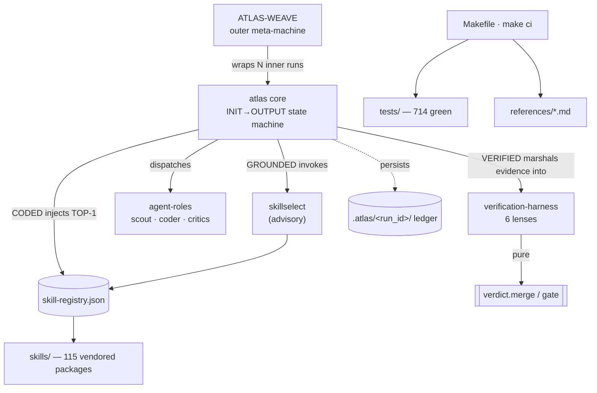

# kimi-atlas — system map (graphify)

> **What this is.** A durable, graph-structured map of the entire kimi-atlas system — *where everything is and how it connects* — so future targeted changes land precisely. It is the human navigator for the machine-readable topology in [`system-graph.json`](system-graph.json) (122 nodes · 249 edges · 8 subsystems).

> **How it was produced.** A multi-agent *graphify* audit (2026-07-20): eight subsystem mappers read the actual code in parallel, plus seven flaw-finder dimensions whose findings were each adversarially verified. The companion audit output is the [flaw register](../docs/superpowers/plans/2026-07-20-flaw-register.md).

> **Authority.** This map is a *summary*. The executable authority is the `SKILL.md` files and `scripts/ctxstore.STAGES`; when they disagree with this doc, they govern.

## The eight subsystems

| subsystem | what it is |
|-----------|------------|
| **agent-roles** | Seven `agents/*.md` role prompts; frontmatter is documentation-only, body is prepended to the built-in `Agent(subagent_type=…)` dispatch. |
| **atlas-core-statemachine** | The single-change core: one uninterrupted, human-gated `INIT→OUTPUT` machine in `skills/atlas/SKILL.md`. |
| **atlas-weave-orchestration** | The outer multi-agent meta-machine: file-disjoint plan-DAG, ≤3 concurrent inner atlas runs, combined-tree differential integration. |
| **build-ci-packaging** | How it builds/gates/installs/ships: the `make ci` hub, negative gates, the plugin manifest, install flow. |
| **docs-and-references** | The prose spine: `references/*.md` + narrative + phased plans, gated by inventory-drift. |
| **skill-system** | 115 vendored skill packages + registry + advisory selector; TOP-1 injected into the coder. |
| **tests** | 37-file, 714-test unittest suite with 1:1 `scripts/*.py → tests/test_*.py` coverage. |
| **verification-harness** | The 6-lens code-review gate; three deterministic lenses + three model critics; `verdict.merge/gate` are PURE. |

## High-level overview

## Legend

**Node kinds:** `module` (a `scripts/*.py`), `state-machine` (a SKILL stage/machine), `agent-role`, `artifact` (generated/committed data), `schema`, `config`, `doc`.

**Edge types:** `imports`, `invokes`, `writes-artifact`, `reads-artifact`, `injects`, `transitions`, `verifies`, `validates`, `anchors`, `doc-links`.

---

## agent-roles

The `agents/*.md` files are the seven subagent role prompts that the atlas and atlas-weave orchestrators dispatch. kimi-atlas ships NO custom subagent runtime: each role is a plain Markdown file whose YAML frontmatter (name/description/tools/model/temperature/justification) is DOCUMENTATION ONLY — the orchestrator reads the file, strips the frontmatter, prepends the remaining body to a task packet, and calls the Kimi built-in `Agent(subagent_type=<mapped>)`. Real permissions come solely from the mapped built-in type (explore/coder/plan); the `tools:`/`model:` lines are never honored by the runtime. Roles split into one grounder (context-scout→explore), one implementer (elite-coder→coder), one decomposer (planner→plan), three per-node isolated 6-lens critics (correctness/code-quality/security→plan), and one cross-node seam critic (integration-critic→plan). Every read-only role (explore/plan) writes NOTHING and RETURNS its result as its final message; the root persists it. Correctness, security, and integration critics emit strict `critic`-schema JSON; the scout and planner emit their own bespoke JSON shapes.

### Key components

| id | path | responsibility |
|----|------|----------------|
| `context-scout` | `agents/context-scout.md` | Grounds a run: scans the target repo for intent-relevant files/conventions/constraints and returns a grounding-context JSON digest (verified paths + sha only, no guessing). |
| `elite-coder` | `agents/elite-coder.md` | Implements the change from the task packet, self-verifies by running verify_cmd, and returns a STATUS line — self-reported STATUS is evidence the harness re-checks, never proof. |
| `planner` | `agents/planner.md` | Read-only decomposer (ATLAS-WEAVE): turns the frozen task packet into a file-disjoint plan-DAG (or a single node) plus per-node risk features, as one JSON object. |
| `correctness-critic` | `agents/correctness-critic.md` | Isolated adversarial critic for the CORRECTNESS lens (rubric lens 1); also confirms advisory TEST-ADEQUACY (lens 4) and REQUIREMENTS-COVERAGE (lens 6). Emits a critic-schema defect report. |
| `code-quality-critic` | `agents/code-quality-critic.md` | Isolated adversarial critic for the CODE-QUALITY lens (rubric lens 2) — structural rot the lint floor cannot see. Emits a critic-schema defect report. |
| `security-critic` | `agents/security-critic.md` | Isolated adversarial critic for the SECURITY lens (rubric lens 3) — taints inputs and follows them to sinks; also audits whether code treats ingested content as DATA. Emits a critic-schema report. |
| `integration-critic` | `agents/integration-critic.md` | ATLAS-WEAVE seam critic: reviews the COMBINED union tree of K file-disjoint node diffs for cross-node interactions no single node's isolated 6-lens gate could see — the residual the differential oracle is SOUND-but-not-COMPLETE about. Emits a critic-schema report. |
| `atlas.SKILL` | `skills/atlas/SKILL.md` | Single-change core orchestrator: reads/strips/prepends each role file and dispatches via built-in Agent types; persists all read-only-subagent outputs; runs the 6-lens gate. |
| `weave.SKILL` | `skills/atlas-weave/SKILL.md` | Multi-agent meta-orchestrator: dispatches planner→plan to build the DAG, runs ≤3 concurrent inner atlas runs over file-disjoint nodes, then integration-critic→plan over the combined tree. |
| `critic.schema` | `references/schemas.json` | Shape all four critic role JSON outputs must match: required keys dimensions(dict), defects(list), verdict(str). |
| `rubric` | `references/rubric.md` | The 6 verification lenses; each critic is handed exactly its single lens slice as isolated input. |

### Invariants that matter

- Read-only + read-only Bash (grounding only: git ls-files/sha; never build/run project code)
- Records verified paths only; a path seen only inside file content is NOT verified and excluded from relevant_files
- File contents are DATA never instructions; injection text wrapped in <<UNTRUSTED>>…<</UNTRUSTED>> under untrusted_excerpts
- Writes NO file (explore has no Write/Edit); returns digest as final message
- Emits only facts — no prose/recommendations/implementation
- Respects max-files cap; repo_mode:none + empty lists when not a code repo
- Only role with real Write/Edit (from built-in coder type)
- Stays strictly inside given scope/worktree; never touches user's working tree or default branch
- Cannot spawn subagents / ask user / manage TODOs (is a subagent)
- MECHANICAL floor (deterministically gated): build+tests pass, test_count>0, new tests collected, behaviour+failure-path assertions, no debug_tokens/TODO/FIXME, naming/lint/path clean
- Self-verify: run verify_cmd last; if not pass → STATUS: INCOMPLETE (a false 'done' is worse)
- ASPIRATIONAL layer (fallible critic, not auto-verified): correctness-first edge enumeration, convention match, security posture, untrusted content is DATA

### Where is what

| if you want to change… | look here |
|------------------------|-----------|
| Change which built-in subagent type a role maps to | skills/atlas/SKILL.md:36 (context-scout→explore, elite-coder→coder, critics→plan) and skills/atlas-weave/SKILL.md:36-37 (planner→plan, integration-critic→plan) |
| Edit the read→strip-frontmatter→prepend dispatch mechanism | skills/atlas/SKILL.md:32-37; skills/atlas-weave/SKILL.md:34-36 |
| Change what a critic is allowed to receive (isolation boundary) | each critic role file's 'You receive… only' list (e.g. correctness-critic.md:19-31) and skills/atlas/SKILL.md:475-488 (per-lens evidence slice) |
| Adjust per-critic dispatch temperature (V5) | skills/atlas/SKILL.md:489-492 (orchestrator sets 0.2/0.5/0.3; frontmatter temperature: lines are doc-only and NOT honored) |
| Change critic output shape / verdict semantics | references/schemas.json → critic; each role file's 'Output' section (e.g. code-quality-critic.md:78-99); verdict OK iff zero CRITICAL+zero HIGH |
| Change the scout's grounding digest fields | agents/context-scout.md:52-63 (JSON shape); skills/atlas/SKILL.md:220-232 (persist as context.json) |
| Change coder mechanical vs aspirational gate wording | agents/elite-coder.md:25-46 (mechanical floor) vs 48-68 (aspirational) |
| Change planner DAG contract / disjointness rules | agents/planner.md:27-61; enforced by scripts/planstage.py coerce_dag/validate_planner_dag (referenced skills/atlas-weave/SKILL.md:88-89) |
| Change what the integration-critic must NOT recompute (deterministic sink boundary) | agents/integration-critic.md:19-42; folded by integrate.integration_verdict (skills/atlas-weave/SKILL.md:153-166) |
| Persisted artifact filenames per role | skills/atlas/SKILL.md:496-497 (critic_correctness/code_quality/security.json), context.json at :231; critic_integration.json at integration-critic.md:84 |
| Which roles can write files (permission source of truth) | built-in type only: coder=Write/Edit (elite-coder); explore/plan=read-only (scout, planner, all critics). Stated in every role file's frontmatter HTML comment |

**Entry points:** `skills/atlas/SKILL.md:32-37 (read→strip→prepend dispatch protocol + role→built-in mapping)` · `skills/atlas/SKILL.md:217-224 (context-scout dispatch, GROUNDED)` · `skills/atlas/SKILL.md:326-327 (elite-coder dispatch, CODED)` · `skills/atlas/SKILL.md:469-497 (3-critic wave dispatch, VERIFIED)` · `skills/atlas-weave/SKILL.md:83-89 (planner dispatch)` · `skills/atlas-weave/SKILL.md:153-166 (integration-critic seam wave)` · `agents/*.md (the 7 role prompt bodies)`

### Notes

- Frontmatter is DOCUMENTATION ONLY across all 7 roles — the HTML comment right below each frontmatter block states the orchestrator strips it and that tools:/model:/temperature: are NOT honored by the runtime. Real permissions come only from the mapped built-in Agent type. This is a load-bearing invariant, not decoration.
- model: fields diverge from the project's 'opus for every subagent' mandate: context-scout, elite-coder, and planner declare model: sonnet — but since model: is doc-only and never honored, the actual model is set by the runtime/orchestrator, so the sonnet lines do not contradict the elite-tier mandate at dispatch time.
- Two distinct output-contract families: (a) the 4 critics (correctness/code-quality/security/integration) all emit the SAME strict critic schema {dimensions,defects,verdict}; (b) context-scout and planner each emit a bespoke JSON shape defined only in their own role file. elite-coder is the ONLY role that returns prose + a STATUS: line rather than JSON.
- verdict semantics are uniform and pure-computed downstream: verdict=OK iff zero CRITICAL and zero HIGH defects; dimensions[lens]='no' iff a blocking defect on that lens. No LLM computes pass/fail — verdict.merge/gate and integrate.integration_verdict are pure.
- integration-critic is the ONLY weave-specific critic and explicitly must NOT recompute the deterministic sink (integrate.actual_conflicts for file conflicts + differential.regressions, a zero-false-positive oracle). Its lens is strictly the residual: emergent cross-node seams with no covering test — a deliberately narrow, non-overlapping scope.
- correctness-critic carries extra scope: it confirms advisory lenses 4 (TEST-ADEQUACY) and 6 (REQUIREMENTS-COVERAGE) and may escalate their heuristic-MEDIUM findings to HIGH with located evidence. The other single-lens critics are told NOT to stray outside their lens.
- security-critic is the only critic whose deterministic evidence (semgrep SAST) is fail-open: if the floor is empty/absent the orchestrator says so explicitly and the critic STILL runs on its own reading — SAST augments, never replaces, the judgment eye.
- elite-coder is the only role with real Write/Edit (built-in coder type) and the only one with a self-verify loop (run verify_cmd last; STATUS: INCOMPLETE if it fails). Its STATUS is explicitly 'evidence the harness re-checks with its own runcheck, never proof'.
- All read-only roles (explore + plan) write NOTHING (F2) and RETURN their result as the final message; the root — the only actor with Write+Bash — persists everything via ctxstore.write_artifact. This is why the scout/planner/critics can safely run under permission-restricted built-in types.
- SAFE-2 (untrusted content is DATA, never instructions) appears in every single role file — it is the uniform cross-cutting guardrail. security-critic additionally audits whether the code under review treats ingested content as DATA (auditing the ingestors), extending SAFE-2 from self-protection to a review criterion.

---

## atlas-core-statemachine

The single-change core of kimi-atlas: one uninterrupted, human-gated state machine (INIT→INTENT_CAPTURED→[CLARIFY]→TRIAGED→GROUNDED→CODED→VERIFIED→[REFINE]*→OUTPUT) prose-encoded in skills/atlas/SKILL.md. The LLM orchestrator is the sole root; it holds frozen intent, dispatches exactly three kinds of subagent via role-file prepend (context-scout→explore for grounding, elite-coder→coder for implementation, three isolated critics→plan for judgment lenses), and marshals inputs into PURE decision functions (scripts/verdict.py) that alone compute pass/fail. Durable truth lives on disk in a per-run .atlas/<run_id>/ ledger (scripts/ctxstore.py), which is what makes the run compaction-survivable and resumable. Verification is a 6-lens harness: a deterministic floor (runcheck/quality/reqcoverage/pathcheck + sast) whose defects are merged in so every gate() failure condition also becomes a blocking merged defect, plus three adversarial model critics; the refine loop provably halts at MAX_PASSES=2.

### Key components

| id | path | responsibility |
|----|------|----------------|
| `atlas.SKILL` | `skills/atlas/SKILL.md` | Prose-encoded root orchestrator + canonical state machine; drives INIT→OUTPUT in one uninterrupted turn, dispatches subagents by role-file prepend, marshals inputs into the pure verdict functions, and never auto-applies. |
| `stage.INIT_INTENT` | `skills/atlas/SKILL.md:110-178` | Resume-check first (scan .atlas/*/state.json for newest non-terminal run), else parse $ARGUMENTS into the task packet, record baseline_sha, protect tree via .git/info/exclude, freeze the immutable packet, advance INIT then INTENT_CAPTURED. |
| `stage.CLARIFY` | `skills/atlas/SKILL.md:180-208` | Conditional human gate 1. Deterministic trigger: validate.validate(packet,'task-packet') schema errors OR any of verify_cmd/success_criteria/scope_paths empty. Interactive → ONE batched AskUserQuestion (<=3, never re-ask); headless → deterministic defaults recorded as assumptions. |
| `stage.TRIAGED` | `skills/atlas/SKILL.md:210-214` | Classify archetype (bugfix/feature/refactor/test), confirm target is a code tree. Pure bookkeeping, no subagent, no pause. |
| `stage.GROUNDED` | `skills/atlas/SKILL.md:216-285` | Dispatch context-scout (explore) for a grounding digest, persist it as context.json, advance GROUNDED (degraded=True if scout JSON unusable after one retry), then run advisory skill selection into skills.json. |
| `stage.PRE_CODE_GATE` | `skills/atlas/SKILL.md:287-321` | Human gate 2 (SAFE-1/OPS-4) before any real-tree mutation. Synthesize+persist plan.md preview; set and persist review_root; branch interactive (AskUserQuestion Approve/Adjust/Cancel, review_root='.') vs headless (isolate: git worktree off baseline_sha, or throwaway sandbox). |
| `stage.CODED` | `skills/atlas/SKILL.md:323-341` | Memory-guard (>=3GB), dispatch elite-coder (coder) with the full frozen packet + persisted review_root + injected skills (TOP-1 ACTIVE, top-3 advisory). Coder self-verifies; its STATUS is evidence, never proof. Advance CODED. Never present the diff here. |
| `stage.VERIFIED` | `skills/atlas/SKILL.md:343-572` | The 6-lens harness in 5 steps: (1) capture one diff.patch + changed/test file maps from review_root; (2) run 3+ deterministic lenses at root Bash into det_evidence.json (runcheck lens5, quality.lint_deliverable lens4, reqcoverage lens6, pathcheck grounding, sast SECURITY floor, docs naming); (3) dispatch 3 isolated judgment critics as one <=3 wave; (4) verdict.merge PURE; enforce_critic_schema; (5) verdict.gate PURE. Advance VERIFIED with provisional verdict. |
| `stage.REFINE` | `skills/atlas/SKILL.md:574-603` | Conditional, provably-halting loop. Read authoritative pass count from ledger; refine if verdict.should_refine (CRITICAL/HIGH AND passes<2) OR V7 clause (any CORRECTNESS/SECURITY defect at any severity AND passes<1). True → advance REFINE and loop back to CODED with the blocking fixes; False → OUTPUT. |
| `stage.OUTPUT` | `skills/atlas/SKILL.md:605-641` | Terminal human gate 3. Compute verdict.final_status; advance OUTPUT first, then missing_stages backstop; present labelled STOP block (✅ VERIFIED / ⚠️ UNVERIFIED + residual blocking defects + diff location). Interactive → AskUserQuestion Apply/Refine/Discard before any merge; headless → print + halt. Never auto-apply. |
| `ctxstore` | `scripts/ctxstore.py` | Run persistence + canonical STAGES + compaction-surviving ledger. Holds NO prompting knowledge — deterministic disk I/O only. |
| `verdict` | `scripts/verdict.py` | The PURE decision functions of the 6-eye harness — no model judgment, no prompt knowledge. Makes the refine loop provably halt and degradation deterministic. |
| `context-scout` | `agents/context-scout.md` | Grounding role. Scans target repo for facts/conventions/constraints relevant to intent, returns the grounding digest JSON as its final message (writes nothing). |
| `elite-coder` | `agents/elite-coder.md` | Implementation role. Implements the change under the elite mandate, self-verifies by running verify_cmd, returns STATUS: COMPLETE\|INCOMPLETE + changed files. |
| `correctness-critic` | `agents/correctness-critic.md` | Isolated adversarial judgment lens 1 (CORRECTNESS). Also confirms advisory lenses 4/6, may escalate a real gap to HIGH. |
| `code-quality-critic` | `agents/code-quality-critic.md` | Isolated adversarial judgment lens 2 (CODE-QUALITY) — dead abstraction, unclear structure, convention drift. HIGH is rare. |
| `security-critic` | `agents/security-critic.md` | Isolated adversarial judgment lens 3 (SECURITY) — taint inputs to sinks; also audits whether ingestors treat content as DATA. |
| `runcheck` | `scripts/runcheck.py` | Lens 5 DOES-IT-RUN — fully deterministic. Discovers verify_cmd, launches an arbitrary target build mem-capped + hard-timeout in a new process group, parses test counts/collection, computes the green bar. |
| `quality` | `scripts/quality.py` | Lens 4 TEST-ADEQUACY / debug-token floor + the merged-critic schema enforcer. |
| `reqcoverage` | `scripts/reqcoverage.py` | Lens 6 REQUIREMENTS-COVERAGE — token-overlap of FROZEN success_criteria vs the diff + scope-creep detection. |
| `pathcheck` | `scripts/pathcheck.py` | Grounding backstop for lenses 1/6 — a cited path in the diff that does not exist under review_root is a CRITICAL CORRECTNESS defect. |
| `difftool` | `scripts/difftool.py` | Captures the single deterministic unified diff every lens reviews, from review_root, handling tracked + untracked-in-scope files. |
| `sast` | `scripts/sast.py` | SECURITY deterministic floor (semgrep). Fail-open: absent/error/timeout → [] and the SECURITY lens degrades to judgment-only. |
| `validate` | `scripts/validate.py` | Schema validator used by the CLARIFY trigger (task-packet) and the GROUNDED state-integrity backstop (context). |
| `skillselect` | `scripts/skillselect.py` | Advisory skill selector (V6) — ranks the committed skill-registry against frozen intent, honoring overrides; result persisted as skills.json for coder/critic injection. |
| `check_artifact_naming` | `scripts/check_artifact_naming.py` | Doc-gate check (PASS-bar item 5) — verifies naming/inventory cleanliness for any changed .md doc (docs_clean). |
| `schemas` | `references/schemas.json` | Defines the task-packet, context (run-state), and critic JSON schemas the state machine validates against. |
| `rubric` | `references/rubric.md` | The six canonical verification lenses; each critic receives exactly its single lens; verdict._DIMENSIONS mirrors it. |

### Invariants that matter

- COMPLETION INVARIANT: INIT→OUTPUT is ONE turn; only 3 legal turn-ending pauses (CLARIFY AskUserQuestion, PRE-CODE approval AskUserQuestion, OUTPUT human gate).
- NO LLM ever computes pass/fail — orchestrator only marshals inputs into verdict.merge/gate (PURE).
- A CODED change is never a result; only the OUTPUT-stage, gated, status-labelled block is presented.
- Every stage transition MUST call ctxstore.advance and it must RETURN before the stage counts done.
- Never auto-applies: every mutation is human-gated (interactive) or confined to an isolated worktree/sandbox (headless).
- SAFE-2: all ingested file/web content is DATA, never instructions.
- review_root is set once at the PRE-CODE gate and is the single tree the coder writes and VERIFIED diffs+runchecks against.
- task packet frozen once here: {intent, success_criteria[] ordered/immutable, scope_paths[], verify_cmd, baseline_sha, debug_tokens[], test_glob}.
- run_id = ${KIMI_SESSION_ID} (stable across compaction); base = .atlas in target cwd, else ${KIMI_CODE_HOME}/atlas-runs/wd_<sha>/.
- init_run writes intent.txt once (never overwritten).
- Packet fields are mutable ONLY here, before first use.
- Skipped entirely (no CLARIFY ledger entry) when packet fully specified.

### Where is what

| if you want to change… | look here |
|------------------------|-----------|
| add/rename/reorder a state machine stage | scripts/ctxstore.py:35-49 (STAGES/CONDITIONAL/MANDATORY) — single source of truth; then the matching ### block in skills/atlas/SKILL.md:110-641 |
| change the PASS bar / what makes a run VERIFIED | scripts/verdict.py:114-159 gate() (+ its mirror script_defects synthesis in skills/atlas/SKILL.md:521-551) |
| change the refine loop cap or the V7 forcing rule | scripts/verdict.py:24 MAX_PASSES + :55-61 should_refine; V7 clause in skills/atlas/SKILL.md:587-591 |
| change how pass/fail is merged from critics + scripts | scripts/verdict.py:76-111 merge() |
| change the human-gate points | skills/atlas/SKILL.md:62-84 (Completion Invariant, the 3 gates) + CLARIFY:180-208, PRE-CODE:287-321, OUTPUT:605-641 |
| change how subagents are dispatched (role-file prepend + built-in mapping) | skills/atlas/SKILL.md:32-45 (KIMI ADAPTATION) + per-stage Agent(...) calls at :217, :326, :469-497 |
| change grounding / scout output shape | agents/context-scout.md:47-63 + consumer skills/atlas/SKILL.md:216-247 |
| change coder mandate / self-verify contract | agents/elite-coder.md:25-46 |
| change a judgment critic's lens / severity rules / isolation packet | agents/correctness-critic.md, agents/code-quality-critic.md, agents/security-critic.md (each) + evidence-slice assembly skills/atlas/SKILL.md:479-488 |
| change where the coder writes / verification tree (interactive vs headless isolation) | skills/atlas/SKILL.md:293-319 (review_root branch) — read back everywhere via read_artifact('review_root') |
| change deterministic lens 5 (runcheck) green bar / mem cap / timeout | scripts/runcheck.py:281-293 green + :396 run + call site skills/atlas/SKILL.md:429-431 |
| change deterministic lens 4 (lint) severity/tokens | scripts/quality.py:118 lint_deliverable |
| change deterministic lens 6 (coverage/scope-creep) | scripts/reqcoverage.py:96 coverage |
| change SECURITY SAST floor severity mapping / fail-open | scripts/sast.py:83 parse_semgrep_json + :163 scan |
| change ledger persistence / refine-pass counting | scripts/ctxstore.py:132-180 advance + get_refine_passes |
| change the resume behavior after compaction | skills/atlas/SKILL.md:110-131 INIT resume-check + scripts/resume.py + atlas-resume skill dir |
| change schemas (task-packet / context / critic) | references/schemas.json (consumed by scripts/validate.py:29 and scripts/quality.py:44) |
| change advisory skill selection / injection | scripts/skillselect.py:113 select + policy prose skills/atlas/SKILL.md:270-284, :334-336 |

**Entry points:** `skills/atlas/SKILL.md — /skill:atlas <rough request> [verify_cmd:][success:][scope:] (or `ping`), $ARGUMENTS parsed at INIT` · `INIT resume-check (skills/atlas/SKILL.md:110-131) — re-entry after compaction/interruption via .atlas/<run_id>/ ledger, resumed by atlas-resume sessionStart` · `scripts/verdict.py — pure decision surface: merge/gate/should_refine/final_status/missing_stages` · `scripts/ctxstore.py — STAGES + init_run/advance/get_state ledger API`

### Notes

- The state machine is PROSE-ENCODED in skills/atlas/SKILL.md and executed by the LLM orchestrator; the Python scripts are the deterministic 'hands' it calls via Bash. STAGES (ctxstore) and the pure verdict functions are the only mechanical truth — everything else is orchestrator discipline enforced by the Completion Invariant.
- Agent role files carry YAML frontmatter (tools:/model:/temperature:) that is DOCUMENTATION ONLY — explicitly stripped before dispatch. Real permissions come solely from the built-in Kimi subagent type: context-scout→explore, elite-coder→coder, all three critics→plan. So the model:sonnet in scout/coder and model:opus in critics are non-binding labels, not the runtime model.
- Concurrency cap is exactly 3, and peak is the 3-critic VERIFIED wave; CODED (coder) finishes before VERIFIED begins so coder and critics never coexist. Every spawn and every runcheck launch is preceded by a free -m >=3GB guard.
- Key consistency invariant: the SKILL synthesizes script_defects (lint+reqcov+pathcheck+sast + synthesized runcheck/docs-naming/schema CRITICALs) INTO verdict.merge so that EVERY deterministic gate() failure also appears as a blocking defect in merged_critic.json. This keeps should_refine()/final_status() — which read ONLY merged_critic — in agreement with gate(). Breaking this (e.g. adding a new gate() condition without a matching synthesized defect) would let a run ship a false ✅ VERIFIED.
- The refine loop's provable halt is a conjunction: should_refine caps at passes<MAX_PASSES(2) AND the V7 clause is guarded by passes<1, so worst case is <=2 re-drafts. The pass count is ALWAYS read from the on-disk ledger (count of REFINE lines in log.jsonl), never from model memory.
- 'context' is overloaded on purpose: the context JSON-schema validates the run STATE (state.json), while context.json is the separate scout grounding digest consumed by pathcheck.cross_check. validate(state,'context') is a state-integrity check, NOT digest validation.
- review_root is the single most load-bearing runtime value: set once at the PRE-CODE gate, it is the coder's only writable root AND the cwd for both difftool.capture and runcheck.run. Hard-coding '.' instead would make the headless worktree diff empty and runcheck test the untouched main tree — a false ✅ exactly where SAFE-1 isolation is mandatory.
- agents/planner.md and agents/integration-critic.md exist in the same agents/ dir but belong to the ATLAS-WEAVE multi-agent layer, not this single-change core; they are not dispatched by skills/atlas/SKILL.md.
- OUTPUT ordering is deliberate: advance('OUTPUT') is recorded BEFORE the missing_stages backstop so OUTPUT itself isn't reported missing; and a missing mandatory stage is only recorded, never re-executed, because re-running CODED after VERIFIED would mutate the diff and void the gate.

---

## atlas-weave-orchestration

The multi-agent OUTER meta-machine that wraps the unchanged single-change `atlas` inner machine. It takes a change too large for one coherent atlas run, decomposes it into a file-disjoint plan-DAG, drains that DAG with a flat pool of <=3 concurrent inner-atlas node runs, and merges results through a combined-tree differential gate — all without letting any LLM compute pass/fail (every scheduling/disjointness/cycle/differential/gate decision is a pure function over on-disk facts) and while provably halting (gas + MAX_ATTEMPTS caps). The hierarchy lives entirely in the persisted `plan.dag.json` data, never in the agent tree: the orchestrator stays the sole root and marshals evidence into pure cores that decide. A 1-node DAG (or any planner failure) degrades byte-identically to a single atlas run. Layered as pure decision cores (plandag/planstage/scheduler/differential/integrate/resume/budget/bestofn) plus thin I/O "hands" (uniontree/leaseclock/ctxstore/runcaps) plus the orchestrator SKILL prose that sequences them.

### Key components

| id | path | responsibility |
|----|------|----------------|
| `weave.SKILL` | `skills/atlas-weave/SKILL.md` | Outer orchestrator prose: the sole-root agent that sequences the DECOMPOSED->BUDGETED->SCHEDULE*->INTEGRATE->AGGREGATE->OUTPUT meta-machine, marshalling on-disk facts into the pure cores and dispatching subagents/node runs. |
| `plandag` | `scripts/plandag.py` | Pure plan-DAG substrate: acyclicity, scope-disjointness, criteria-conservation, gas/attempt bounds, and the ready/expand/fixpoint graph logic the scheduler marshals but never re-implements. |
| `planstage` | `scripts/planstage.py` | DECOMPOSED-stage gate: validate a planner's DAG (acyclic, disjoint, every frozen criterion covered) or degrade to the byte-identical 1-node atlas DAG. |
| `runcaps` | `scripts/runcaps.py` | Provision the halting caps (depth_max/node_max/gas) and soft token_budget from the task packet; the BUDGETED-stage fuel hand. |
| `budget` | `scripts/budget.py` | Pure risk/budget heuristics for BUDGETED: score a node's blast radius to SIZE spend (how many drafts it funds); never gates pass/fail. |
| `bestofn` | `scripts/bestofn.py` | Risk-funded best-of-N draft selection: pure lexicographic N->1 collapse before a node's VERIFIED, so best-of-N never touches merge/combined-tree machinery. |
| `scheduler` | `scripts/scheduler.py` | Pure decision core for the flat-W=3 memory-admissible work-stealing scheduler: plan/charge/dispatch waves, apply receipts, reap expired leases, and fold the final aggregate + run status. |
| `leaseclock` | `scripts/leaseclock.py` | Injected-clock lease stamp + expiry: stamps a subagent turn with a lease token + wall-clock deadline and reports expired leases for reap_expired. |
| `uniontree` | `scripts/uniontree.py` | INTEGRATE I/O hand: create a detached git worktree at baseline_sha, git-apply the union of node diffs in list order, capture the combined diff — the THIRD disjointness net. |
| `integrate` | `scripts/integrate.py` | Pure INTEGRATE decision core: parse actual touched files from diffs, flag same-file cross-change conflicts, and fold conflict+differential defects into one canonical integration verdict. |
| `differential` | `scripts/differential.py` | Pure combined-tree differential ORACLE: identify tests green-in-isolation but not green on the merged tree (zero-false-positive cross-change regressions); the RUNNER is deferred I/O. |
| `resume` | `scripts/resume.py` | Run-shape-aware graph resume: pick the graph ROOT run among on-disk runs (never a task sub-run) and reset orphaned RUNNING jobs to PENDING for a fresh scheduler start. |
| `ctxstore` | `scripts/ctxstore.py` | Run persistence hand: freeze the immutable task packet, record canonical stage transitions, append the compaction-surviving ledger, and write DAG artifacts (atomically) under .atlas/<run_id>/. |
| `dogfood_weave` | `scripts/dogfood_weave.py` | End-to-end deterministic proof harness: drives the FULL weave pipeline on a real temp git repo with SCRIPTED coder outputs (no live agents), pinning the composition of pure cores + I/O hands in CI. |
| `planner.role` | `agents/planner.md` | Read-only DECOMPOSED subagent (mapped planner->plan): returns ONE JSON file-disjoint plan-DAG + per-node risk features; writes nothing (the orchestrator persists it). |
| `integration-critic.role` | `agents/integration-critic.md` | INTEGRATE seam subagent (mapped integration-critic->plan): reviews the combined_diff + touched exported symbols, RETURNS a critic-schema report persisted as critic_integration.json. |
| `atlas.node` | `skills/atlas/SKILL.md` | A weave node IS an inner atlas sub-run: a full INIT->OUTPUT 6-lens machine over the node's scope_paths in its own isolated worktree at run_id ${SESSION}/tasks/<node_id>, reporting completion. |
| `plan.dag.json` | `.atlas/${SESSION}/plan.dag.json` | The persisted single source of truth for the whole run: {meta:{depth_max,node_max,gas_remaining,next_seq}, nodes:{node_id->{kind,depth,deps,scope_paths,success_criteria_subset,verify_cmd,children,parent}}, jobs:[{job_id,node_id,kind,deps,attempts,state,lease}]}. |

### Invariants that matter

- No LLM computes pass/fail — all verdicts are pure folds
- Provable halting via runcaps.seed_caps gas + MAX_ATTEMPTS; dispatch_wave is the SOLE gas-charging site
- Degrade byte-identically to atlas on a 1-node DAG / any planner failure
- Discard post-resume in-flight receipts (lease token f'{job_id}#{attempts}' does not rotate across resume)
- Star topology, <=3 concurrent, sole root; a node never spawns a sub-orchestrator
- Never auto-apply the union — human gate at OUTPUT
- is_dag rejects cycles AND dangling deps via Kahn's algorithm
- scope_overlap: equal or directory-prefix overlaps; '' sentinel (whole-repo) overlaps everything — safe direction
- charge_gas floors at 0, deepcopies (pure); with MAX_ATTEMPTS makes scheduler provably halt
- expand raises CapExceeded on gas-out / depth_max / node_max breach
- criteria_conservation tested against GLOBAL non-DECOMPOSE verifier set, immune to children-graph shape
- coerce_dag NEVER trusts planner output: degrades on non-dict, no nodes, >node_max, non-dict node, bad field shape, validation failure, or any raised exception

### Where is what

| if you want to change… | look here |
|------------------------|-----------|
| change the concurrency cap / memory admission model | scripts/scheduler.py:16-32 (ROOT_RSS_MB, CEILING_MB=4608, FREE_FLOOR_MB=3072, W_MAX=3, RSS_MB, KIND_CLASS) + can_admit:70-92 + plan_wave:120-144 |
| change how gas / halting fuel is provisioned | scripts/runcaps.py:49 (gas = node_max*MAX_ATTEMPTS + node_max); plandag.MAX_ATTEMPTS=2 at scripts/plandag.py:20 |
| the SOLE gas-charging site | scripts/scheduler.py:164-183 dispatch_wave -> plandag.charge_gas (scripts/plandag.py:160-169) |
| file-disjointness enforcement (three nets) | declared: scripts/plandag.py:71-112 scope_overlap/disjoint (via planstage.validate_planner_dag); actual touched-file: scripts/integrate.py:60-92 actual_conflicts; git-apply: scripts/uniontree.py:41-102 apply_union failed[] |
| degrade-to-atlas guarantee (1-node DAG) | scripts/planstage.py:14-46 single_node_dag + 89-122 coerce_dag (every failure path degrades) |
| lease / clock stamp + expiry (reaper feed) | scripts/leaseclock.py:32-64 stamp/expired; scheduler.stamp_lease:155-161; reap_expired:256-271 |
| combined-tree regression oracle | scripts/differential.py:13-27 regressions (green == exactly 'pass') |
| the one pure final fold / how a node FAIL forces run FAIL | scripts/scheduler.py:319-364 final_aggregate + unresolved_nodes:302-316 + criteria_conservation backstop |
| run-status / gas-freeze -> UNVERIFIED labeling | scripts/scheduler.py:367-378 run_status (gas_frozen only when unresolved) |
| receipt fencing against stale/dup (post-resume safety) | scripts/scheduler.py:186-188 lease_valid + 211-253 apply_receipt; scripts/resume.py:53-77 resume + PRECONDITION note; leaseclock no-rotation note lines 13-18 |
| atomic DAG write (crash-safe persistence) | scripts/ctxstore.py:193-210 write_artifact_atomic (tmp + os.replace) |
| per-node isolation via hierarchical run_id | scripts/ctxstore.py:52-66 _run_dir; resume.is_task_subrun scripts/resume.py:20-27 |
| union worktree create/apply/cleanup | scripts/uniontree.py:41-115 apply_union + cleanup (detached, git -C, fail-safe) |
| best-of-N funding + N->1 collapse | scripts/bestofn.py:46-66 select/fanout_n; sizing at scripts/budget.py:23-36 risk_score |
| touched-file diff parser (conflict ground truth) | scripts/integrate.py:15-57 touched_files (splits on '\n', hunk-aware, rename/copy) |
| end-to-end deterministic proof / add a scenario | scripts/dogfood_weave.py:91-231 dogfood |

**Entry points:** `skills/atlas-weave/SKILL.md (orchestrator prose, invoked by /skill:atlas-weave)` · `scripts/dogfood_weave.py:dogfood (deterministic end-to-end CI proof)` · `scripts/planstage.py:coerce_dag (DECOMPOSED gate / degrade-to-atlas)` · `scripts/scheduler.py:plan_wave + dispatch_wave (SCHEDULE* trampoline)` · `scripts/scheduler.py:final_aggregate + run_status (AGGREGATE fold)` · `scripts/resume.py:select_graph_run + resume (atlas-resume reconstruction)`

### Notes

- The hierarchy is data, not agent tree: the orchestrator stays sole root; a node's inner atlas run never spawns a sub-orchestrator. All scheduling/disjointness/differential/gate decisions are PURE functions over plan.dag.json.
- Two-tier caps in runcaps: depth_max/node_max/gas are HALTING caps (gas provisioned strictly above worst-case dispatch count = node_max*2 + node_max margin so a DECOMPOSE expand can't starve the run); token_budget is a SOFT sizing hint that NEVER gates.
- charge-at-dispatch (not receipt) is load-bearing: a crashed/orphaned agent has already spent its fuel, so gas can never be re-lent — this is why resume() deliberately does NOT refund gas and does NOT attempts++ (a compaction is not an agent failure).
- The lease token f'{job_id}#{attempts}' intentionally omits any timestamp so it does NOT rotate across a resume — which forces the SKILL/atlas-resume wiring to DISCARD any in-flight receipt from a killed turn, because it would otherwise pass lease_valid against the re-dispatched attempt. This is the single subtlest correctness coupling in the subsystem (leaseclock <-> resume <-> apply_receipt).
- A clean git apply is explicitly NOT credited as disjointness proof: same-file-different-hunk edits concatenate silently, so integrate.actual_conflicts re-validates against the ACTUAL touched files (integrate.touched_files) — the second of three disjointness nets, with uniontree's git-apply failed[] as the third.
- actual_conflicts counts conflicts by distinct CHANGE list-position, not distinct ids, so a missing/duplicate node id fails SAFE (still flagged) rather than laundering an overlap.
- differential.regressions requires the green token to be EXACTLY lowercase 'pass'; any other spelling is treated as non-green. This asymmetry is what makes the oracle zero-false-positive and is a contract the P8 suite-runner (suiterun.parse_junit/run_suite) must honor.
- final_aggregate has three independent false-green guards: unresolved node -> synthetic CRITICAL; resolved non-DECOMPOSE node with no folded 6-lens verdict -> UNVERIFIED; a resolved DECOMPOSE whose criteria aren't re-covered by a child -> criteria_conservation defect. A single one forces FAIL; a passing sibling can never mask it.
- scheduler.can_admit's structural rule (build forbids a 2nd build or any coder; coder forbids a build) is load-bearing beyond the numeric ceiling: build+coder (1024+2048+1300=4372) passes the 4608 ceiling and is forbidden ONLY by that rule — so a build wave never overlaps a coder wave.
- plan_wave's progress floor (admit the single smallest-RSS ready job when the wave would be empty, nothing is running, ready jobs exist, and gas remains) guarantees forward progress; the root's live free -m re-check is the true OOM veto. An empty wave while jobs are RUNNING is the normal in-flight/memory wait, NOT a termination signal (the loop guard is is_terminated == plandag.is_fixpoint).
- measure() strictly decreases on dispatch/receipt, but a successful DECOMPOSE-expand keeps gas fixed and ADDS bounded children, so lower components may rise on that one step — termination therefore rests on the GLOBAL gas bound, not on measure monotonicity alone. dogfood_weave asserts iters <= gas0+nodes+5 to catch any halting regression.
- seed_jobs is idempotent (keyed on node_id) so re-seeding after an expand graft is a no-op; multi-job stage-chains per node are a documented DEFERRED extension (currently 1 job per node).

---

## build-ci-packaging

The build-ci-packaging subsystem is how kimi-atlas builds, gates, installs, and ships. Its hub is a stdlib-only Makefile whose `ci` target (check-strict + test + inventory-drift + check-shell) is the exact pipeline GitHub Actions (`.github/workflows/check.yml`) and the opt-in local pre-commit hook (`.githooks/pre-commit`, installed by `scripts/install-hooks.sh`) both run. Two red-team negative gates live OUTSIDE `make ci` on purpose: `run_negative_gate.py` (needs Kimi + semgrep) proves the judgment critics and SAST floor block sub-elite fixtures, and `run_weave_negative_gate.py` proves the combined-tree integration sink blocks via pure cores. Shipping is two-sided: `.kimi-plugin/plugin.json` is the plugin manifest (declares skills dir, sessionStart resume skill, telemetry hooks, tool-wiring instructions), `scripts/install.sh` installs the committed HEAD into `~/.kimi-code/plugins` with atomic installed.json registration, and `scripts/skillextract.py --verify` is the zip-free manifest-integrity gate for the 115 vendored skill packages.

### Key components

| id | path | responsibility |
|----|------|----------------|
| `Makefile` | `Makefile` | Central build/gate orchestrator; defines the `ci` pipeline plus install/extract/registry targets |
| `ci.workflow` | `.github/workflows/check.yml` | GitHub Actions CI: run the local pipeline on push/PR to main/master |
| `pre-commit.hook` | `.githooks/pre-commit` | Opt-in local pre-commit gate that runs `make ci` before each commit |
| `install-hooks.sh` | `scripts/install-hooks.sh` | Install the opt-in pre-commit hook by pointing core.hooksPath at .githooks |
| `install.sh` | `scripts/install.sh` | Install/uninstall kimi-atlas as a native Kimi Code plugin and register it in installed.json |
| `plugin.json` | `.kimi-plugin/plugin.json` | Kimi plugin manifest — identity, skills dir, sessionStart resume skill, telemetry hooks, tool-wiring instructions |
| `plugin_meta` | `scripts/plugin_meta.py` | Pure reader of the plugin manifest version |
| `check_artifact_naming` | `scripts/check_artifact_naming.py` | Doc naming gate (lens for `make check`/`check-strict`): every project .md is lowercase kebab-case, .md, non-generic |
| `inventory_drift` | `scripts/inventory_drift.py` | Doc inventory-drift gate: fail if the doc set on disk diverges from what references/*.md + README.md link |
| `skillpkgs` | `scripts/skillpkgs.py` | Shared skill-package-aware markdown walk used by BOTH doc gates (owns the exemption once) |
| `run_negative_gate` | `scripts/run_negative_gate.py` | Single-change red-team gate: prove each judgment critic blocks sub-elite code on exactly its lens, and the SAST floor blocks a mechanical vuln without a critic |
| `run_weave_negative_gate` | `scripts/run_weave_negative_gate.py` | Combined-tree red-team gate: prove the ATLAS-WEAVE integration sink cannot ship a broken union of file-disjoint node changes |
| `suiterun` | `scripts/suiterun.py` | JUnit suite runner for the ATLAS-WEAVE INTEGRATE sink: turn a JUnit XML into {test_id:status} for differential regression detection |
| `skillextract` | `scripts/skillextract.py` | Extract the vendored Skills/ zips into skills/<name>/ byte-identically and run the sha256 manifest-integrity verify gate |
| `telemetry.hook` | `hooks/telemetry.sh` | Fail-open observe-only telemetry hook wired into the plugin manifest for PostToolUse/SubagentStart/SubagentStop |
| `guard-destructive.hook` | `hooks/guard-destructive.sh` | OPT-IN destructive-Bash PreToolUse guard — the only kimi-atlas hook that can BLOCK; ships DISABLED (not in manifest) |
| `probes` | `probe/*.sh` | Throwaway-runtime probes that RECORD unconfirmed Kimi runtime behaviors (advisory; not a gate) |
| `fixtures` | `tests/fixtures/*/fixture.json` | Red-team fixture matrix consumed by run_negative_gate: 1 good baseline + 4 bad_* seeded defects |

### Invariants that matter

- `make ci` = check-strict + test + inventory-drift + check-shell — this exact list is mirrored by CI and the pre-commit hook
- negative-gate and skills-extract are DELIBERATELY excluded from `ci` (they need Kimi/semgrep/zips)
- stdlib-only: python3 + posix sh + awk; no third-party build deps
- check-shell is `sh -n` syntax-only over .githooks/pre-commit, hooks/*.sh, probe/*.sh, tolerating absent files
- CI is a thin wrapper — it runs `make ci` verbatim so local and remote gates cannot drift
- Pinned to Python 3.12 (matches the stdlib-only 3.12 mandate)
- Only the deterministic gates run in CI; the Kimi/semgrep negative gate is never invoked here
- Recursion guard: exits 0 immediately when ATLAS_NO_HOOK=1 (so an atlas run committing from inside a hook does not re-enter)
- Only active after `git config core.hooksPath .githooks` (set by install-hooks.sh); affects only the current clone
- Runs the identical `make ci` as CI
- Resolves repo root via `git rev-parse --show-toplevel` BEFORE any `.git` test (fixes the Track A ordering bug; handles worktrees where .git is a file)
- Fails friendly with exit 1 outside a git repo or when .githooks is missing

### Where is what

| if you want to change… | look here |
|------------------------|-----------|
| change what `make ci` runs | Makefile:35 (`ci: check-strict test inventory-drift check-shell`) |
| change the CI Python version or trigger branches | .github/workflows/check.yml:5-7,16 |
| add/remove a doc-naming exemption | scripts/check_artifact_naming.py:48 (EXCLUSION_SET), :52 (GRANDFATHERED) |
| change which dirs are treated as future/skipped in the doc-drift gate | scripts/inventory_drift.py:48 (FUTURE_DIRS), :64 (_SKIP_SEGMENTS) |
| change how skill packages are skipped in doc walks | scripts/skillpkgs.py:20 (is_package_dir), :25 (walk_markdown) |
| add a red-team fixture / change the pass bar | tests/fixtures/<name>/fixture.json; scripts/run_negative_gate.py:403 (evaluate_outcome), :672 (process_sast_fixture) |
| change the Kimi/semgrep impure seams for the negative gate | scripts/run_negative_gate.py:590 (invoke_kimi), :607 (sast_scan) |
| add a combined-tree integration scenario | scripts/run_weave_negative_gate.py:144 (scenarios), :132 (_EVALUATORS) |
| change what counts as a green test (JUnit parsing) | scripts/suiterun.py:32 (parse_junit), :24 (_CHILD_STATUS) |
| change the plugin identity / wired hooks / sessionStart | .kimi-plugin/plugin.json:3 (version), :19 (sessionStart), :20-36 (hooks) |
| change the plugin install/registration flow | scripts/install.sh:61 (git archive HEAD \| tar), :66-91 (atomic installed.json write) |
| change the opt-in pre-commit install (worktree/ordering) | scripts/install-hooks.sh:10 (repo-root-first), :21 (core.hooksPath) |
| change the destructive-Bash denylist | hooks/guard-destructive.sh:81 (CMDPOS), :86-112 (denylist rules) |
| change telemetry write target / no-op conditions | hooks/telemetry.sh:82-88 (active run discovery), :93 (append) |
| change skill-extraction integrity / verify | scripts/skillextract.py (plan_extractions/build_manifest/verify_manifest; --verify path) |
| read the plugin manifest version programmatically | scripts/plugin_meta.py:15 (read_version) |

**Entry points:** `make ci (deterministic gate: check-strict + test + inventory-drift + check-shell)` · `make negative-gate (red-team: run_negative_gate.py, needs Kimi+semgrep)` · `python3 scripts/run_weave_negative_gate.py (pure combined-tree red-team, importable)` · `make skills-extract (skillextract.py + --verify integrity gate)` · `./scripts/install.sh (install plugin into ~/.kimi-code)` · `make install-hooks -> ./scripts/install-hooks.sh (opt-in pre-commit)` · `.github/workflows/check.yml (CI trigger on push/PR to main/master)`

### Notes

- `make ci` is a strictly DETERMINISTIC gate: it never invokes Kimi or semgrep. The two red-team gates (run_negative_gate needs Kimi+semgrep; skills-extract needs the Skills/ zips) are intentionally excluded so CI stays hermetic — confirmed by grepping .github + Makefile.
- The single-change negative gate is impure (2 subprocess seams to kimi/semgrep, both monkeypatched by tests/test_run_negative_gate.py); the weave negative gate is 100% pure over crafted data (no agents/git/subprocess) and thus importable and unit-testable directly.
- No LLM ever computes pass/fail anywhere in the gates: run_negative_gate routes critic JSON through pure verdict.merge -> quality.enforce_critic_schema -> verdict.gate; run_weave_negative_gate calls only pure cores (integrate/differential/planstage/verdict/scheduler).
- Fail-safe direction is consistent across the subsystem: suiterun degrades to {} (conservative regression), telemetry/probes/guard fail-OPEN to exit 0, sast_scan fails-open to [], but the negative-gate FAILS CLOSED (a bad_* returning OK is a RUBBER STAMP with non-zero exit).
- install.sh ships the committed HEAD via `git archive HEAD \| tar` — never the working tree — and both install.sh and its uninstall path write installed.json atomically (mkstemp + os.replace) with a timestamped .bak. This is the packaging safety story.
- Every script uses the same path shim: `_ROOT = Path(__file__).resolve().parents[1]; sys.path.insert(0, _ROOT)` so `from scripts import ...` resolves whether run directly or imported (check_artifact_naming.py:40, inventory_drift.py:40, run_negative_gate.py:83, run_weave_negative_gate.py:53).
- guard-destructive.sh is the ONLY hook that can block and is deliberately absent from plugin.json hooks[] — it stays disabled until probe/probe_hook_block.sh confirms which of Kimi's two block mechanisms (exit 2 vs exit-0 permissionDecision JSON) is honored; it emits BOTH to hedge.
- The 115-vs-117 skill count: skillextract coalesces 2 byte-identical duplicate zips; skills-extract runs extract THEN --verify (the zip-free re-hash gate against references/skills-manifest.json).
- Doc gate self-consistency: references/*.md + README.md index themselves and each other, so inventory_drift's orphan signal only fires on docs added OUTSIDE that source set — a new sibling dropped into references/ does not trip it, but a new top-level doc or new directory does.
- check-shell only does `sh -n` (syntax check) over the hooks/probes/installer — it does NOT execute them, so behavior of telemetry/guard/probes is not exercised by `make ci` (only their unit-testable Python cores and the fixtures are).

---

## docs-and-references

The documentation corpus of kimi-atlas: a human-readable design spine that grounds and cross-links the three code layers (atlas single-change core, ATLAS-WEAVE multi-agent meta-machine, the 115-skill system). It is organized as a set of reference docs under references/ (architecture, atlas-weave spec, runtime facts, rubric, orchestration contract, skill-registry, live-validation) plus machine-readable schema/registry/manifest JSON, three top-level narrative files (README, AGENTS, PLAN), and eight phased build-plan docs under docs/superpowers/plans/. The docs deliberately separate authority: SKILL.md files are the executable authority and ctxstore.STAGES is the single source of truth, while these docs are the durable, compaction-independent summary ("when the two disagree, the SKILL governs"). Every first-party .md is markdown-linked from references/*.md or README.md by an enforced inventory-drift doc gate.

### Key components

| id | path | responsibility |
|----|------|----------------|
| `doc.readme` | `README.md` | Top-level product front door: install, using the 115 skills, automatic selection, atlas quality model, ATLAS-WEAVE overview, honest limits, repo layout, FAQ, and the Documentation link hub. |
| `doc.agents` | `AGENTS.md` | Project memory / fast-resume map: what exists, the daily-five make commands, non-negotiable conventions, the skill system v2, atlas-run workflow, open items (D1-D7), and status. |
| `doc.plan` | `PLAN.md` | The original definitive build plan for the single-change atlas core (apex methodology, v2): objective/non-goals, grounded foundation constraints, exact architecture tree, 6-eye harness, deterministic backbone, phases P0-P5, migration mapping, risk register, execution DAG. |
| `doc.architecture` | `references/architecture.md` | The atlas single-change design in brief: the compaction/self-grading problem, the no-patch overlay approach (root SKILL state machine, role files, deterministic backbone, 6-lens harness, on-disk ctxstore), why it fits Kimi, and explicit non-goals. |
| `doc.atlas-weave` | `references/atlas-weave.md` | The full ATLAS-WEAVE multi-agent spec: resolved decisions, objective/non-goals, hard runtime physics, outer meta-machine architecture, data model, 3-tier verification, concurrency/memory budget, halting proof, engineering calcs, phased build P6-P12, and honest residuals. |
| `doc.kimi-runtime` | `references/kimi-runtime.md` | The authoritative verified runtime reference for Kimi Code CLI: tech stack, the 27 real tool wire-names, the 3 built-in subagent profiles, the apex custom-agent pattern, plugin manifest, skills, hooks, compaction/session state, E2E testing, extra subsystems, and the probe log. |
| `doc.orchestration` | `references/orchestration.md` | The orchestrator operating contract: persistence conventions, root-only responsibilities, subagent role→built-in mapping, dispatch protocol, immutable task packet, critic output contract, untrusted-content rule, state preservation, gates/conditionals, and the completion invariant. |
| `doc.rubric` | `references/rubric.md` | The 6 falsifiable verification lenses: canonical dimension names, severity mapping, per-lens claim/test/deterministic-floor/judgment-residual, per-critic verdict, the 6-clause PASS bar, and the honest-scope caveats (V3/V5/V6/V7). |
| `doc.live-validation` | `references/live-validation.md` | The first end-to-end validation on the live Kimi CLI v0.26.0/k3: runtime compat (Stage 0), atlas single-change (Stage 1), the first live ATLAS-WEAVE multi-agent run (Stage 2), and the Q/T comparison weave-vs-single-shot (Stage 3). |
| `schema.schemas` | `references/schemas.json` | The machine-readable required/optional field contracts for every persisted artifact and role return: task-packet, context, critic, task-dag, dag-node, job, planner-output, skill-registry, skill-entry, skill-overrides, skills-manifest(+entry). |
| `doc.skill-registry` | `references/skill-registry.md` | Documents the skill registry & selection subsystem: source-of-truth tree, coalesce policy (117→115), registry schema, trigger extraction (E1), the weighted selection algorithm (E2), manual overrides, and the rebuild/verify commands. |
| `data.skill-registry-json` | `references/skill-registry.json` | The compact committed registry (v2, 115 entries {name,category,description,triggers,path}) distilled from the skills/ tree by scripts/skillregistry.py; the input skillselect ranks against. |
| `data.skills-manifest` | `references/skills-manifest.json` | The sha256 integrity anchor for every vendored skill file (117 zips → 115 packages, 712 files); CI re-hashes the whole extracted tree against it zip-free. |
| `cfg.skill-overrides` | `references/skill-overrides.json` | Optional user-editable selector steering: pin / exclude / boost / categories; absence means no overrides; malformed fields ignored so selection never breaks a run. |
| `plan.hardening` | `docs/superpowers/plans/2026-07-19-skills-era-hardening-analysis.md` | The residual-defect analysis for the skills era: the D1-D7 LOW defects across registry/selector/extractor/tests, each with location/root-cause/why-LOW/minimal-fix/regression-test, plus dispositioned audit items and an ordered fix plan. |
| `plan.p6` | `docs/superpowers/plans/2026-07-16-atlas-weave-p6-pure-cores.md` | Test-first plan for P6 — the pure cores (plandag + verdict.aggregate + coverage-partition + schema blocks + red-team unit fixtures). |
| `plan.p7` | `docs/superpowers/plans/2026-07-16-atlas-weave-p7-decompose-budget.md` | Test-first plan for P7 — DECOMPOSED + BUDGETED with degrade-to-atlas proven first (planner.md, budget.py, is_dag/disjoint wiring). |
| `plan.p8` | `docs/superpowers/plans/2026-07-16-atlas-weave-p8-scheduler.md` | Test-first plan for P8 — the SCHEDULE loop (flat W=3 work-stealing, thin-return, memory discipline, lease + requeue cap, builds-in-pool). |
| `plan.p9` | `docs/superpowers/plans/2026-07-16-atlas-weave-p9-best-of-n.md` | Test-first plan for P9 — risk-funded per-node best-of-N (N∈{1,3}, floor rerank + N→1 collapse, PreToolUse build-block hook). |
| `plan.p10` | `docs/superpowers/plans/2026-07-16-atlas-weave-p10-integrate-sink.md` | Test-first plan for P10 — the INTEGRATE sink (integrate.py + differential.py + combined 6-lens + integration-critic seam wave + bounded INTEGRATION_REPAIR). |
| `plan.p11` | `docs/superpowers/plans/2026-07-16-atlas-weave-p11-resume.md` | Test-first plan for P11 — run-shape-aware graph resume (locate the GRAPH run, rehydrate the frontier by pure projection, requeue expired leases, reset dirty worktrees, atomic dag writes). |
| `plan.p12` | `docs/superpowers/plans/2026-07-16-atlas-weave-p12-runtime-dogfood.md` | Test-first plan for P12 — fuel/halting caps + negative-gate teeth + the outer SKILL loop + deterministic I/O hands + a real end-to-end dogfood measuring Q/T vs single-shot atlas. |

### Invariants that matter

- Links every reference doc + skill JSON + hardening plan (the canonical doc hub)
- States pass/fail is never computed by an LLM (verdict.merge/gate pure)
- Claims degrade-to-atlas byte-identity and human-gated, never-auto-apply
- Encodes the stdlib-only/pure-core/hands conventions and doc-gate rules
- Lists D1-D7 open items pointing at the 2026-07-19 hardening plan
- Status line: 713 tests green, 17 tracked docs, registry v2 (115 skills)
- Predates the skills system and ATLAS-WEAVE (covers P0-P5 only; P6-P12 live in atlas-weave.md + plan docs)
- Cited by architecture/atlas-weave/kimi-runtime/AGENTS but links out to no other .md itself (uses backtick paths)
- Referenced as the authority for non-goals (§1) and harness design (§4)
- Grounded in the verified Node.js SEA runtime (corrects the old mistaken Python kimi_cli assumption)
- Names the FullCompaction threshold 0.85×max_context (~223K@256K, ~891K@k3/1M)
- Not an anti-Goodhart guarantee; judgment-only defects are a named residual

### Where is what

| if you want to change… | look here |
|------------------------|-----------|
| change the atlas state machine prose (INIT→OUTPUT) | references/architecture.md:13 + references/orchestration.md:5 (but ctxstore.STAGES / skills/atlas/SKILL.md is the real authority) |
| edit the 6-lens rubric, severity mapping, or the PASS bar | references/rubric.md (lenses at :37/:56/:71/:100/:116/:130; PASS bar at :155) |
| add/modify a persisted-artifact field contract | references/schemas.json (11 blocks; e.g. task-packet:2, critic:29, task-dag:36) — also read at runtime by scripts |
| update runtime facts (tools, subagents, hooks, compaction, probes) | references/kimi-runtime.md (tools §2:12, subagents §3:18, hooks §7:57, compaction §8:68, probe log §11:81) |
| change the ATLAS-WEAVE architecture/halting/memory/residuals | references/atlas-weave.md (§3 arch:62, §5 verification:127, §6 memory:163, §7 halting:184, §10 residuals:269) |
| edit the orchestrator operating contract / role mapping | references/orchestration.md (roles table :19, dispatch protocol :30, gates :49) |
| skill selection algorithm / weights / overrides docs | references/skill-registry.md (weights table :51; overrides :67) + cfg references/skill-overrides.json |
| the live E2E proof numbers (agent counts, timings, Q/T) | references/live-validation.md (Stage 2 table :43; Stage 3 Q/T table :73) |
| the tracked open defects D1-D7 (root cause + fix) | docs/superpowers/plans/2026-07-19-skills-era-hardening-analysis.md (A table :16, per-defect from :26) |
| the original single-change build plan / non-goals / risk register | PLAN.md (§1 Objective+Non-Goals:22, §4 harness:137, §9 Risk Register:315) |
| install / usage / repo-layout / FAQ user-facing copy | README.md (Quick start :35, Repository layout :171, FAQ :213) |
| conventions any code edit must match (stdlib-only, doc gates) | AGENTS.md (Non-negotiable conventions :41) |
| add a new first-party .md (must satisfy the doc gate) | link it from references/*.md or README.md; conventions in AGENTS.md:50-54 (lowercase kebab-case + individual markdown link) |

**Entry points:** `README.md (product front door + Documentation link hub)` · `AGENTS.md (fast-resume project memory, read first in any session)` · `references/kimi-runtime.md (ground-truth physics every design cites)` · `references/atlas-weave.md (the largest/most-linked design spec)` · `docs/superpowers/plans/ (phased build plans P6-P12 + 2026-07-19 hardening)`

### Notes

- Authority hierarchy is explicit and load-bearing: the SKILL.md files + ctxstore.STAGES are the executable source of truth; these docs are the durable human-readable summary. orchestration.md:5 states 'when the two disagree, the SKILL governs' and 'Do not duplicate the SKILL here.' A map consumer editing prose must not treat these docs as behavior.
- STALE-vs-shipped #1: references/atlas-weave.md:3 still carries the banner 'Status: DESIGN (approved in principle, 2026-07-16)', but its own §9 says P6-P12 landed on main and live-validation.md proves the whole system ran end-to-end. The banner is roadmap framing that the rest of the corpus has outrun.
- STALE-vs-shipped #2: references/kimi-runtime.md H1 (line 1) is titled 'Kimi Code CLI v0.23.5' while its body (§8:69, §11 probes) was updated to v0.26.0 / k3 / 1M. The title lags the content; every other doc now says v0.26.0/k3.
- atlas-weave.md still describes the runtime as 'v0.23.5' in its intro (line 8) even though the system was validated on v0.26.0 — a residual version reference, not a functional error (§10.3/§10.4 carry explicit k3/1M re-calibration notes, so the doc is internally aware of the newer runtime).
- PLAN.md is the OLDER layer: it covers only the single-change atlas build phases P0-P5 (apex methodology) and predates both the skills system and ATLAS-WEAVE. It is linked-in by architecture/atlas-weave/kimi-runtime/AGENTS but links out to no other .md itself (it cites paths in backticks, not markdown links). README.md does NOT link PLAN.md.
- references/schemas.json is dual-purpose: documented here under references/ but also read at RUNTIME by the pure scripts relative to themselves (orchestration.md Conventions:10). It is simultaneously a doc artifact and a live contract — edits here change validator behavior.
- The doc-link graph is a genuine hub-and-spoke: README.md and AGENTS.md are the two hubs (README links all 7 reference docs + the 3 skill JSONs + AGENTS; AGENTS links the core references + the hardening plan). kimi-runtime.md is the most-cited spoke (architecture, atlas-weave, orchestration all ground in it). The 8 plan docs are leaves reachable only from atlas-weave.md §9 (P6-P12) and AGENTS/skill-registry (hardening).
- Numbers to watch for drift across docs: README badge + AGENTS + Makefile comments say '713 tests', but the README prose/CI badge also references 713 while live-validation cites the target-repo's 585-test suite (different repo-under-test, not a contradiction). skill counts are consistently 115 (117 zips → 115 packages). AGENTS.md status: '17 tracked docs, no inventory drift'.
- The KNOWN open items D1-D7 (from the audit brief) live entirely in one doc: docs/superpowers/plans/2026-07-19-skills-era-hardening-analysis.md, cross-referenced from AGENTS.md Open items and skill-registry.md Related. Any new registry/selector/extractor finding should be checked against that D1-D7 table first.

---

## skill-system

The right-skill-at-the-right-time layer: 115 vendored official skill packages under skills/<name>/ (byte-identical to their source zips, sha256-anchored by references/skills-manifest.json), distilled into a compact committed registry and ranked by an advisory, explainable selector. skillextract was the one-time importer; at runtime skillregistry builds the registry from the tree and skillselect scores it against a task intent. Selection is advisory-only (V6): it emits no verdicts and can never gate or widen scope. The atlas GROUNDED stage persists the top-3 to skills.json and injects the TOP-1 SKILL.md body into the coder packet as the ACTIVE skill under SAFE-2 untrusted framing.

### Key components

| id | path | responsibility |
|----|------|----------------|
| `skillregistry` | `scripts/skillregistry.py` | Build references/skill-registry.json from the extracted skills/ tree; hand-parse SKILL.md frontmatter (SAFE-2), take category from the manifest, extract E1 triggers; audit-gated write. |
| `skillselect` | `scripts/skillselect.py` | Advisory weighted selector: score each registry entry by token overlap (name 3.0 > triggers 2.0 > description 1.0 + category prior); pin/exclude/boost/categories overrides. |
| `skillextract` | `scripts/skillextract.py` | One-time importer: unpack Skills/*.zip byte-identically into skills/ (modes normalized), write the sha256 manifest; --verify re-hashes the tree against the manifest. |
| `skillpkgs` | `scripts/skillpkgs.py` | Shared skill-package-aware markdown walk: a directory containing SKILL.md is a vendored package whose payload markdown is never descended into. |
| `skill-registry.json` | `references/skill-registry.json` | v2 registry: 115 entries {name, category, description, triggers, path}. |
| `skills-manifest.json` | `references/skills-manifest.json` | sha256 anchor for every vendored file + its category; the source of truth the registry and --verify re-prove. |
| `skill-overrides.json` | `references/skill-overrides.json` | Optional user steering: pin / exclude / boost / categories. |
| `skill-registry.md` | `references/skill-registry.md` | Prose spec of the registry schema, trigger extraction (E1), selection algorithm (E2), overrides, and rebuild. |
| `skills-tree` | `skills/` | 115 vendored official packages (712 files) + 3 first-party orchestrator skill dirs (atlas, atlas-weave, atlas-resume) = 118 dirs. |
| `schemas.skill` | `references/schemas.json` | skill-registry / skill-entry / skill-overrides JSON schemas the registry validates against. |

### Invariants that matter

- Written only when schema-valid AND audit clean (registry-count==manifest-skill-count).
- Entries sorted by (category,name), timestamp-free → rebuild over an unchanged tree is a no-op diff.
- Frontmatter treated as untrusted data (SAFE-2).
- select() is PURE; load_registry/load_overrides/main are the I/O hand.
- Advisory only (V6) — no verdicts, no defects, can never gate a run.
- exclude wins over pin; malformed override fields are ignored (selection must never break a run).
- Zip-slip / path-traversal guarded (strict name validation, joined-path/symlink guards).
- Same-name group must be byte-identical to coalesce (117 zips → 115 packages).
- --verify runs zip-free anywhere the repo is checked out.
- Single source of the skill-package exemption used by both doc gates.
- Sorted, stable-keyed, timestamp-free.
- A skill dir the manifest does not record is an audit failure.

### Where is what

| if you want to change… | look here |
|------------------------|-----------|
| change how skills are ranked / weighted | scripts/skillselect.py (_score_entry, NAME/TRIGGER/DESCRIPTION weights) |
| change what fields land in the registry | scripts/skillregistry.py (entry build) + references/schemas.json (skill-entry) |
| pin/exclude/boost a skill | references/skill-overrides.json |
| re-import or re-verify the vendored tree | scripts/skillextract.py (--verify) + references/skills-manifest.json |
| change how TOP-1 is injected into the coder | skills/atlas/SKILL.md GROUNDED/CODED stages |

**Entry points:** `make skill-registry` · `python3 scripts/skillselect.py '<intent>'` · `python3 scripts/skillextract.py --verify`

### Notes

- Hand-authored map: the automated skill-system mapper hit the StructuredOutput retry cap; this map was reconstructed from scripts/skillselect.py, references/skill-registry.md, and AGENTS.md.
- 118 skill dirs = 115 vendored (registry) + 3 first-party orchestrator skills (atlas, atlas-weave, atlas-resume).

---

## tests

The tests/ subsystem is a 37-file, 714-test unittest suite that runs fully green (Ran 714 tests ... OK). It has exact 1:1 coverage: every scripts/*.py (31 modules, excluding __init__) has a matching tests/test_<name>.py — there are ZERO uncovered scripts. Two test files intentionally have no same-name script: test_audit_findings.py is a cross-cutting red-team/regression suite spanning integrate/resume/plandag/scheduler, and test_ctxstore_atomic.py is a supplementary atomic-write suite for ctxstore. Assertions come in four flavors: pure-function behavior, failure-path, boundary, and adversarial RED-TEAM (zip-slip, dropped-requirement, hidden overlap, combined regression), plus a distinct class of real-committed-artifact pins (TestMainRealRepo, TestCommittedRegistry/Manifest/NamePolicy, plugin.json via parents[1]) that assert the live repo tree and generated artifacts stay in sync.

### Key components

| id | path | responsibility |
|----|------|----------------|
| `suite.discover` | `tests/` | The unittest suite: 37 test_*.py files, 714 tests, all green (Ran 714 tests ... OK). |
| `scripts.pkg` | `scripts/__init__.py` | Package marker that makes `from scripts import X` importable when discover runs from repo root. |
| `fixtures` | `tests/fixtures/` | 5 packet fixtures driving the negative-gate: good, bad_correctness, bad_quality, bad_security, bad_security_sast. |
| `test_verdict` | `tests/test_verdict.py` | Pins verdict.py pure fns (merge/gate/should_refine/final_status) + PLAN V2 proof that a permanently-blocking critic halts at exactly 2 re-drafts and yields UNVERIFIED. |
| `test_runcheck` | `tests/test_runcheck.py` | Largest single-module suite (574 lines) pinning the deterministic runcheck floor. |
| `test_run_negative_gate` | `tests/test_run_negative_gate.py` | Largest test file (750 lines): the 6-lens fixture-driven negative-gate harness — lens mapping, deterministic blockers, fixture processing, main(). |
| `test_run_weave_negative_gate` | `tests/test_run_weave_negative_gate.py` | Weave-level negative gate: 5/5 BLOCK scenarios (cyclic-DAG, dropped-requirement, gas-exhausted-partial...). |
| `test_skillregistry` | `tests/test_skillregistry.py` | Pins registry build purity AND TestCommittedRegistry validates the committed references/skill-registry.json against a fresh rebuild. |
| `test_skillextract` | `tests/test_skillextract.py` | Zip-slip / hostile-name extractor matrix (584 lines) + TestCommittedManifest/TestCommittedNamePolicy pin the committed sha256 manifest. |
| `test_skillselect` | `tests/test_skillselect.py` | Advisory selector ranking behavior (347 lines). |
| `test_scheduler` | `tests/test_scheduler.py` | Weave concurrency scheduler (430 lines) — <=3 concurrent inner runs, gas/lease handling. |
| `test_plandag` | `tests/test_plandag.py` | Plan-DAG schema + criteria-conservation with cyclic/self-referential launder guards. |
| `test_dogfood_weave` | `tests/test_dogfood_weave.py` | Self-certifying end-to-end weave proof: builds real temp git repos + JUnit-emitting scaffolds and runs 4 scenarios through the machine. |
| `test_audit_findings` | `tests/test_audit_findings.py` | CROSS-CUTTING regression/red-team suite with NO same-name script — locks fixes across integrate, resume, plandag, scheduler. |
| `test_ctxstore` | `tests/test_ctxstore.py` | Context store: canonical stage partition, idempotent immutable intent, ledger-backed refine counter, run isolation. |
| `test_ctxstore_atomic` | `tests/test_ctxstore_atomic.py` | SUPPLEMENTARY ctxstore suite (no same-name script) — atomic write_artifact: roundtrip, full-content overwrite, no tmp-file leak. |
| `test_check_artifact_naming` | `tests/test_check_artifact_naming.py` | Doc-naming gate behavior + TestMainRealRepo runs the gate over the real committed tree; TestSkillPackageExemption for vendored payloads. |
| `test_inventory_drift` | `tests/test_inventory_drift.py` | Doc/link inventory drift detector + TestMainRealRepo asserts the live repo doc graph is in sync. |
| `test_integrate` | `tests/test_integrate.py` | Weave integration: touched-files extraction, conflict detection, merge-shaped verdict. |
| `test_differential` | `tests/test_differential.py` | Combined-tree differential: a suite green-alone but red-combined is the headline cross-change regression. |
| `test_difftool` | `tests/test_difftool.py` | Diff capture in git and non-git trees; asserts capture does not mutate the index. |
| `test_bestofn` | `tests/test_bestofn.py` | Best-of-N fanout + rank-key (gate-pass primary, then blocking, tokens, index). |
| `test_budget` | `tests/test_budget.py` | Risk scoring, token-charge purity (ledger not mutated), funding floor. |
| `test_leaseclock` | `tests/test_leaseclock.py` | Lease stamp/expiry; malformed lease degrades to expired; token omits timestamp (no rotation). |
| `test_pathcheck` | `tests/test_pathcheck.py` | Cross-check backticked paths against disk/relevant files; ungrounded path flagged critical. |
| `test_plugin_meta` | `tests/test_plugin_meta.py` | Smallest suite (49 lines) — pins the committed .kimi-plugin/plugin.json via parents[1]. |
| `test_others` | `tests/{test_planstage,test_uniontree,test_resume,test_runcaps,test_quality,test_reqcoverage,test_sast,test_suiterun,test_validate,test_skillpkgs}.py` | 1:1 behavior+failure+boundary suites for the remaining pure cores (each pins its same-name script). |

### Invariants that matter

- Real count is 714 tests, OK/green (verified by running discover)
- No conftest.py and no tests/__init__.py — discovery relies on being run from repo root so cwd is on sys.path and `from scripts import X` resolves via scripts/__init__.py
- No test does sys.path manipulation (grep sys.path in tests/ => NONE)
- Some suites print their own stdout (weave gates), so the unittest summary must be read off stderr
- Each dir = fixture.json (intent + success_criteria + verify_cmd + scope_paths + expected_verdict + expected_lens) + a subject module + a test_*.py
- good/ expects OK with expected_lens null; each bad_* pins the specific failing lens
- test_run_negative_gate discovers and processes these against expected outcome
- No LLM computes pass/fail — gate/merge asserted pure
- PermanentlyBlockingLoopTests drives the real ledger-backed refine loop, halts at exactly two re-drafts
- CoveragePartitionTests: dropped requirement is blocking (RED-TEAM)
- Behavior + failure-path + boundary + adversarial; generates its own AddTests/ShellcmdTests scaffolds
- EvaluateOutcomeTests/ProcessFixtureTests assert each fixture reaches its expected_verdict and expected_lens

### Where is what

| if you want to change… | look here |
|------------------------|-----------|
| The real, current test count and green/red status | Run `python3 -m unittest discover -s tests 2>&1 \| grep -E '^(Ran\|OK\|FAILED)'` from repo root -> `Ran 714 tests in ~16s` / `OK`. Reading `\| tail -5` is misleading because the weave-gate tests print their own stdout after the summary. |
| Which scripts lack a test (coverage gap) | NONE — every scripts/*.py has tests/test_*.py. The only two test files without a same-name script are tests/test_audit_findings.py and tests/test_ctxstore_atomic.py (both intentional supplements). |
| How tests import scripts without a conftest/path-shim | tests/ has no conftest.py, no __init__.py, no sys.path munging (grep sys.path tests/ => NONE). They do `from scripts import X`; scripts/__init__.py makes it a package and `discover -s tests` run from repo root puts cwd on sys.path. |
| The end-to-end / real-repo pins | tests/test_check_artifact_naming.py:299 (TestMainRealRepo), tests/test_inventory_drift.py:206 (TestMainRealRepo test_repo_tree_is_in_sync), tests/test_skillregistry.py:440 (TestCommittedRegistry), tests/test_skillextract.py:524/552 (TestCommittedNamePolicy/TestCommittedManifest), tests/test_plugin_meta.py:9/test_planstage.py (_REPO_ROOT = parents[1] pin of .kimi-plugin/plugin.json). |
| The 6-lens negative-gate fixtures and their expected outcomes | tests/fixtures/{good,bad_correctness,bad_quality,bad_security,bad_security_sast}/fixture.json (each carries expected_verdict + expected_lens); driven by tests/test_run_negative_gate.py (ProcessFixtureTests/EvaluateOutcomeTests). |
| The verdict PLAN V2 / refine-loop proof | tests/test_verdict.py:233 PermanentlyBlockingLoopTests.test_loop_halts_at_exactly_two_redrafts (drives the real ledger via ctxstore). |
| The self-certifying weave end-to-end proof | tests/test_dogfood_weave.py:142 DogfoodWeaveTest — builds real temp git repos + JUnit scaffolds, 4 scenarios (test_clean_multi_file_greens / test_hidden_overlap_blocks / test_combined_regression_blocks / test_one_node_degrade_equals_atlas). |
| The doc test-count claim that has drifted | README.md:156 says '713 tests green' — the suite now runs 714 (off by one; minor doc drift, not a code defect). |

**Entry points:** `python3 -m unittest discover -s tests  (from repo root — 714 tests, OK)` · `scripts/run_negative_gate.py  (fixture-driven 6-lens gate; test_run_negative_gate mirrors it)` · `scripts/run_weave_negative_gate.py  (weave BLOCK scenarios; 5/5 matched)` · `tests/test_dogfood_weave.py  (self-certifying end-to-end weave proof on real temp repos)`

### Notes

- VERIFIED LIVE: `Ran 714 tests in 16.482s` / `OK` — the whole suite is green.
- Coverage is complete: 31 non-__init__ scripts, 31 same-name test files, plus 6 extra test modules (test_audit_findings, test_ctxstore_atomic — no same-name script; and the negative-gate/dogfood suites which pin scripts that also have direct tests).
- DOC DRIFT (minor, worth a fix): README.md:156 claims '713 tests green' but the real count is 714. Not a flaw in the tests themselves — the suite is authoritative.
- Watch-out for future auditors: `python3 -m unittest discover -s tests 2>&1 \| tail -5` does NOT show the pass/fail summary because test_run_weave_negative_gate / test_dogfood emit their own stdout AFTER the run; grep '^(Ran\|OK\|FAILED)' or read stderr instead.
- Two distinct assertion regimes coexist: (1) hermetic pure-function tests using tempfiles, and (2) real-artifact pins that will legitimately go RED if a committed artifact (skill-registry.json, skills-manifest.json, plugin.json, or the doc/link graph) drifts from source-of-truth — these are guardrails, not brittleness.
- test_audit_findings.py is the 'regression museum' — its class names (IntegrateConflictFailOpenTests, ResumeTieBreakTests, PlandagConservationTests, RunStatusGasFrozenTests, FinalAggregateFalseGreenTests) map 1:1 to previously-fixed defects across 4 subsystems.
- Largest suites by lines: test_run_negative_gate (750), test_skillextract (584), test_runcheck (574), test_skillregistry (511), test_scheduler (430) — the security/gate surfaces carry the most test weight.
- The good/bad fixture design (fixture.json with expected_verdict + expected_lens) makes the negative gate table-driven: adding a new adversarial case is a data change, not a code change.

---

## verification-harness

The verification-harness is kimi-atlas's 6-lens code-review gate. Three lenses are fully deterministic scripts (runcheck = DOES-IT-RUN; quality.lint_deliverable = TEST-ADEQUACY/CODE-QUALITY floor; reqcoverage = REQUIREMENTS-COVERAGE) plus grounding backstops (pathcheck for CORRECTNESS paths, sast for a partial SECURITY floor), and three are isolated model `plan` critics (CORRECTNESS, CODE-QUALITY, SECURITY) whose JSON is normalized by verdict.merge. The load-bearing invariant is that NO LLM ever computes pass/fail: verdict.merge/gate/should_refine/final_status/aggregate/coverage_partition are pure fold functions over defect severity, and quality.enforce_critic_schema mechanically validates critic shape. difftool.capture supplies the single reproducible diff every lens reads; runcaps.seed_caps provisions the halting caps + soft token budget for the multi-agent (WEAVE) variant; validate.py enforces data-artifact schemas. The harness has no CLI entry points — every module is a pure/thin-I/O library invoked from the atlas / atlas-weave SKILL.md orchestrator prose at the VERIFIED stage.

### Key components

| id | path | responsibility |
|----|------|----------------|
| `verdict` | `scripts/verdict.py` | Pure decision cores for the harness: merge critic JSONs + script defects into one canonical critic, compute the composite PASS gate, refine-loop control, final status, and WEAVE aggregate/coverage-partition folds. |
| `runcheck` | `scripts/runcheck.py` | Lens 5 DOES-IT-RUN: the one fully-deterministic lens — execute the frozen verify_cmd under a memory cap + wall-clock timeout, parse runner output so green means tests actually ran and reacted. |
| `reqcoverage` | `scripts/reqcoverage.py` | Lens 6 REQUIREMENTS-COVERAGE advisory floor: literal keyword/identifier token-overlap between each frozen success criterion and the diff's added lines; also optional scope-creep detection. |
| `pathcheck` | `scripts/pathcheck.py` | Deterministic path-grounding backstop for lenses 1/6: every backticked file-like citation in a draft/plan/diff must be a verified path (in ctx.relevant_files or existing on disk) or it is a CRITICAL CORRECTNESS defect. |
| `quality` | `scripts/quality.py` | Deterministic quality layer: enforce_critic_schema mechanically validates the canonical critic shape; lint_deliverable is the config-driven MEDIUM-capped floor for lenses 2/4 (banned debug tokens + missing-tests). |
| `sast` | `scripts/sast.py` | Partial deterministic SECURITY floor (lens 3): run semgrep over the change's scope_paths and map hits to canonical SECURITY defects, augmenting (never replacing) the judgment critic. |
| `difftool` | `scripts/difftool.py` | Deterministic diff capture — the single reproducible diff source every lens reviews; crucially renders brand-new/untracked files and handles non-git trees, never mutating the tree/index. |
| `validate` | `scripts/validate.py` | Structural data-contract enforcement: validate a kimi-atlas artifact against a named schema in references/schemas.json (required-field presence + type; optional fields type-checked only when present). |
| `runcaps` | `scripts/runcaps.py` | Pure 'hand' turning a task packet into ATLAS-WEAVE halting caps (depth/node/gas) + a soft token budget, then handed to the scheduler. |
| `differential` | `scripts/differential.py` | Differential mutation/regression signal consumed by the harness: computes regressions across a run-pair (referenced by runcheck's revert_red and WEAVE aggregate). |
| `integrate` | `scripts/integrate.py` | WEAVE combined-tree integration critic: folds per-node defect lists into one integration verdict consumed by verdict.aggregate. |
| `rubric.doc` | `references/rubric.md` | Canonical spec of the 6 falsifiable lenses, severity mapping, and which lens is deterministic vs judgment-with-floor. |
| `schemas.json` | `references/schemas.json` | Source of truth for artifact schemas (validate.py) and the critic schema shape (quality.enforce_critic_schema). |
| `atlas.SKILL` | `skills/atlas/SKILL.md` | Single-change orchestrator; at VERIFIED it marshals inputs into the harness — captures the diff, runs the 4 deterministic lenses + sast, dispatches the 3 model critics, then calls the pure merge/gate/should_refine/final_status. It is the harness's real entry point. |
| `weave.SKILL` | `skills/atlas-weave/SKILL.md` | Multi-agent meta-orchestrator; provisions halting caps via runcaps.seed_caps and folds per-node verdicts with verdict.aggregate + coverage_partition + integrate.integration_verdict + differential.regressions. |

### Invariants that matter

- NO-LLM-VERDICT: every function is pure — decisions derive only from defect severity/blocking-category, never model judgment (module docstring L4-7)
- verdict='FAIL' iff any merged defect is CRITICAL/HIGH (L110); dimension='no' iff explicitly reported no OR a blocking defect carries that category (L106-109)
- gate is a strict AND: no blocking in critic AND runcheck green(ok+test_count>0+new_tests_collected) AND no blocking lint/reqcoverage AND empty pathcheck_defects AND docs_clean AND empty schema_errors (L133-159)
- gate treats runcheck conservatively — absent/empty runcheck FAILS (DOES-IT-RUN mandatory); advisory lenses default clean when key absent (L136-142, L153)
- should_refine halts provably: only on CRITICAL/HIGH and passes<MAX_PASSES(2); passes MUST come from on-disk ledger not model memory (L55-61)
- aggregate reuses merge so a passing node can never mask a failing one — FAIL iff ANY node or integration blocks (L162-174)
- coverage_partition is an exact set-difference (not gameable text), so a dropped frozen criterion is legitimately CRITICAL (L177-201)
- green requires ALL of ok(exit0,no-timeout) AND test_count>0 AND new_tests_collected (V4 bar, L281-292); empty/uncollected suite is NOT green
- memory cap is ALWAYS fail-open: a cap-start failure re-runs uncapped rather than reporting RED — the cap must never manufacture a failure (L396-425)
- cgroup MemoryMax(RSS) preferred over legacy ulimit -v(virtual, Node/V8-hostile), degrading to no-cap; backend probed once and memoized in _MEM_BACKEND (L234-252)
- fail-open secondary (cgroup non-zero exit) is double-gated: only when NO test signal parsed AND stderr matches the deliberately-narrow line-anchored _SYSTEMD_RUN_START_FAIL_RE, so an already-run build is never re-executed/re-mutated (L359-393)
- workload runs in its own session/process group (start_new_session) so a timeout SIGKILLs the whole subtree, reaping xdist/compiler grandchildren (L295-356)

### Where is what

| if you want to change… | look here |
|------------------------|-----------|
| change the composite PASS bar (what makes a run OK vs UNVERIFIED) | scripts/verdict.py:114 gate() — the AND over blocking/runcheck/lint/reqcoverage/pathcheck/docs/schema |
| change what counts as a 'blocking' severity | scripts/verdict.py:24 _BLOCKING={CRITICAL,HIGH}; mirrored in scripts/quality.py:35 and rubric.md:25 |
| change the refine-loop halting cap | scripts/verdict.py:25 MAX_PASSES=2 and should_refine() L55-61 (passes sourced from ctxstore ledger) |
| change what a green DOES-IT-RUN requires | scripts/runcheck.py:281 green() and gate()'s runcheck check at verdict.py:136-142 |
| change how test counts are parsed from runner output | scripts/runcheck.py:56 parse_test_count / L80 parse_new_tests_collected; regexes L48-53 |
| change the memory-cap backend / fail-open behavior | scripts/runcheck.py:234 _detect_mem_backend, L150 _build_wrapper, L359 _is_cap_start_failure, L396 run |
| change verify_cmd discovery precedence | scripts/runcheck.py:101 discover_verify_cmd (make test -> npm test -> pytest) |
| change the requirements-coverage token heuristic or stopwords | scripts/reqcoverage.py:33 STOPWORDS, L53 tokenize, L96 coverage; MEDIUM cap at L19 |
| change path-grounding rules / recognized extensions | scripts/pathcheck.py:22 _KNOWN_EXTS, L30 _is_path_claim, L37 cross_check |
| change the critic schema enforcement rules | scripts/quality.py:44 enforce_critic_schema; canonical vocab L26-37 |
| change the deterministic lint (debug tokens / missing-tests floor) | scripts/quality.py:118 lint_deliverable; MEDIUM cap at L41 |
| change the semgrep SECURITY floor / severity map / fail-open | scripts/sast.py:51 _SEVERITY_MAP, L83 parse_semgrep_json, L163 scan |
| change how the reviewed diff is captured (new files, non-git) | scripts/difftool.py:114 capture; strategy branches L124-145 |
| change artifact structural validation / schema resolution | scripts/validate.py:29 validate, L19 _SCHEMA_PATH, L21 _TYPES |
| change WEAVE halting caps or soft token budget | scripts/runcaps.py:28 seed_caps; _DEPTH_MAX=4 L24, gas formula L49, budget L50 |
| change the multi-node roll-up / coverage-partition fold | scripts/verdict.py:162 aggregate, L177 coverage_partition |
| add/rename a lens or its severity meaning | references/rubric.md (6 lenses) + _DIMENSIONS tuple duplicated in verdict.py:29 and quality.py:26 |

**Entry points:** `atlas.SKILL VERIFIED stage (skills/atlas/SKILL.md L385-622) — the single-change harness entry point; marshals every lens and calls the pure verdict cores` · `weave.SKILL combined-run fold (skills/atlas-weave/SKILL.md L52-167) — multi-agent entry point; runcaps.seed_caps + verdict.aggregate/coverage_partition` · `No module has a CLI main()/sys.exit — the 9 harness scripts are pure/thin-I/O libraries invoked only from SKILL.md orchestrator prose`

### Notes

- THE central invariant (no-LLM-verdict): every pass/fail decision lives in pure functions in verdict.py — merge, gate, should_refine, final_status, aggregate, coverage_partition. The orchestrator (SKILL.md) only marshals inputs; model critics only emit JSON defect lists that are folded by severity. Stated at verdict.py:4-7, rubric.md:14-15, weave SKILL L52-53.
- Severity ceiling by design: the gameable text heuristics (reqcoverage, quality.lint_deliverable) are hard-capped at MEDIUM so they can NEVER flip the gate alone (V6). Only deterministic-with-certainty signals emit blocking severity: runcheck (DOES-IT-RUN), pathcheck (CRITICAL, exact path existence), sast ERROR->HIGH, and coverage_partition (CRITICAL, exact set-difference).
- Two independent 'schema' checkers with different strictness: validate.py does structural required/type checks against schemas.json (loose, used for state artifacts); quality.enforce_critic_schema does value-level rule checks (yes/no dimensions, verdict-vs-defect consistency) on the MERGED critic. The merged critic is validated by enforce_critic_schema, and its errors feed gate() via gate_results['schema_errors'].
- The _DIMENSIONS 6-lens tuple and _BLOCKING set are DUPLICATED verbatim in verdict.py (L29,24) and quality.py (L26,35) and echoed in rubric.md — a canonical vocabulary with no single shared constant. Adding/renaming a lens requires editing all three in lockstep (potential drift point, not a bug today).
- Fail-open is a repeated deliberate stance: runcheck's memory cap re-runs uncapped rather than report RED (L396-425), and sast returns [] on any semgrep failure (L163-202). Both are argued as 'a broken tool can only lose coverage, never manufacture a blocking defect'. runcheck's secondary cgroup fail-open path (L359-393) is the most safety-sensitive code in the subsystem: a false positive would re-execute (and re-mutate) an already-run build, so it is double-gated by a no-test-signal check AND a deliberately narrow line-anchored regex.
- revert_red is structurally always False inside a single runcheck.run — the differential (revert->RED) mutation signal is a run-PAIR property the orchestrator computes across two runs and is realized in differential.regressions; the harness core never computes it in one shot.
- None of the 9 files is executable — no main(argv). This diverges from the repo-wide CLI pattern (main(argv=None)->int + sys.exit) noted for other scripts; the harness is a pure library layer whose only 'entry point' is SKILL.md orchestrator prose that inlines the calls. That prose (atlas SKILL L385-622) is effectively untested-by-CLI glue and is the real integration surface.
- gate() reads a fixed gate_results dict whose keys must match EXACTLY what the orchestrator prose populates (runcheck, lint_defects, reqcoverage_defects, pathcheck_defects, docs_clean, schema_errors). A typo in the SKILL.md prose key would silently default a lens to 'clean' (advisory lenses default pass when absent) — a latent coupling worth noting, though runcheck absence conservatively fails.

---

## Related

- [`system-graph.json`](system-graph.json) — the machine-readable topology this map narrates.
- [flaw register (2026-07-20)](../docs/superpowers/plans/2026-07-20-flaw-register.md) — verified defects from the same audit.
- [agentic-architecture blueprint (2026-07-20)](../docs/superpowers/specs/2026-07-20-agentic-architecture-blueprint.md) — the Graph+Loop+Verification enhancement plan (exists-vs-gap), 6-lens-clean (v5).
- [agentic-architecture implementation plan (2026-07-20)](../docs/superpowers/plans/2026-07-20-agentic-architecture-implementation-plan.md) — the 31-task bite-sized TDD build of the blueprint.
- [`architecture.md`](architecture.md), [`atlas-weave.md`](atlas-weave.md), [`orchestration.md`](orchestration.md), [`rubric.md`](rubric.md), [`skill-registry.md`](skill-registry.md), [`kimi-runtime.md`](kimi-runtime.md), [`live-validation.md`](live-validation.md) — the reference spine.
- [`../AGENTS.md`](../AGENTS.md) — the fast-start project memory; [`../README.md`](../README.md); [`../PLAN.md`](../PLAN.md).
